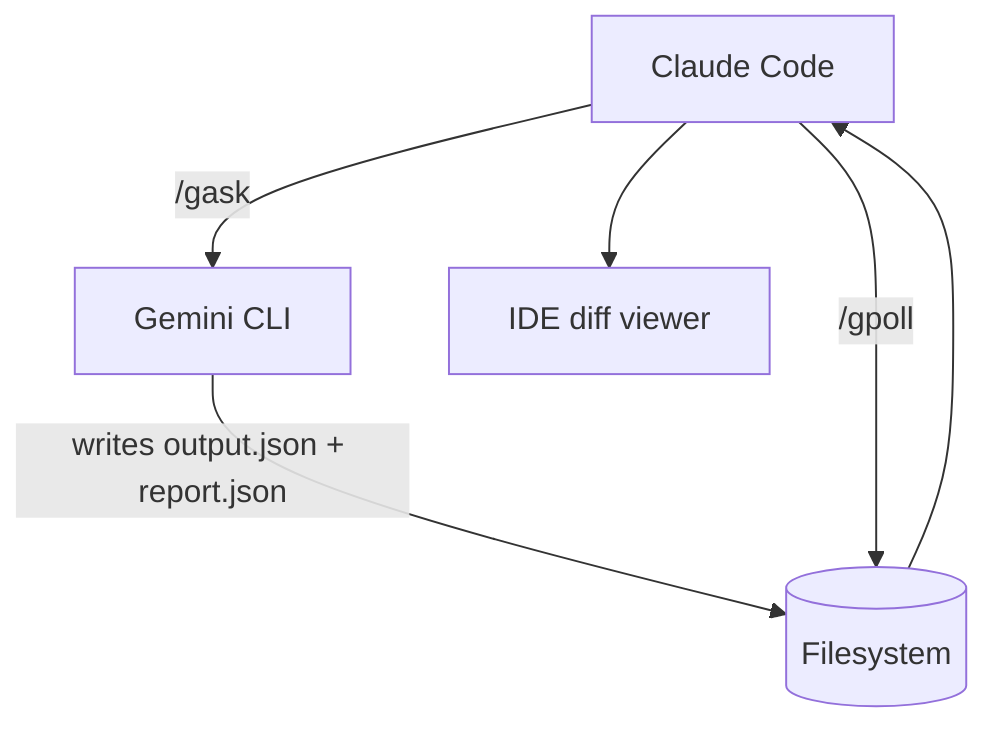

# Gemini CLI ✕ Claude Code Integration Guide

> **Purpose**  Give Claude Code clear, token‑smart rules for orchestrating heavy‑lift tasks with Google Gemini CLI and only escalating to Claude Opus when strictly necessary.

---

## 1 · Architecture at a Glance

| Actor           | Role                                            | Typical Token Load |
| --------------- | ----------------------------------------------- | ------------------ |
| **Claude Code** | Orchestrator, light reasoning, prompt crafter   | 0 – 20 k / job     |
| **Gemini CLI**  | Bulk processing, ≥1 M‑token context, multimodal | 50 k – 1 M / job   |
| **Claude Opus** | Deep reasoning emergency parachute              | ≤5 k / rare jobs   |

---

## 2 · Token Economy & Costs

| Model                    | Input \$/M tok | Output \$/M tok | Free Tier              |
| ------------------------ | -------------- | --------------- | ---------------------- |
| **Gemini CLI (Pro 2.5)** |  `$0 – 2.50`   | `$0 – 10`       | 60 req/min · 1 000/day |
| **Claude Sonnet 4**      | `$3`           | `$15`           |  –                     |
| **Claude Opus 4**        | `$15`          | `$75`           |  –                     |

**Rule of Thumb** — Exhaust Gemini’s free/cheap tokens first; keep Claude’s totals modest; reach for Opus *only* when logic depth beats context size.

---

## 3 · Setup & Authentication

```bash
# Install CLI (Node ≥ 18)
npm i -g @google/gemini-cli

# Environment
export GEMINI_API_KEY="${{SECRET_KEY}}"  # store via secret‑manager in CI
```

* OAuth tokens cache → `~/.config/gemini/`  •  One auth var at a time (`GOOGLE_API_KEY` **or** `GEMINI_API_KEY`).

---

## 4 · Claude Code Slash‑Commands

| Command                                     | What It Does                                   |
| ------------------------------------------- | ---------------------------------------------- |
| **`/gsetup key=<env>`**                     | Verify key, add `gemini` wrapper to allow‑list |
| **`/gindex <path>`**                        | Run `gemini index <path>` once per repo        |
| **`/gask "<prompt>" [-f <file>] [--json]`** | Launch job with boilerplate (section 6)        |
| **`/gpoll <job_id>`**                       | Poll filesystem/API for `END_OF_JOB` flag      |
| **`/gcleanup <job_id>`**                    | Remove temp files/logs when done               |

> *All commands are idempotent and should write concise logs (< 20 lines).*
> *All file paths must be absolute to avoid sandbox drift.*

---

## 5 · Standard Gemini Job Workflow



1. **Preparation**  `/gindex` (only first time per repo).
2. **Execution**  `/gask` fires Gemini with structured output.
3. **Waiting**  `/gpoll` sleeps 2 s between checks until `"END_OF_JOB": true`.
4. **Review**   Claude reads just `report.json`, IDE surfaces diffs.
5. **Cleanup**  `/gcleanup` deletes temp artefacts.

---

## 6 · Boilerplate Gemini Prompt

```text
### CONTEXT (persist for job lifespan)
job_id: {{uuid}}
project: {{repo_or_dataset}}
desired_granularity: overview
output_mode: json_summary
diff_handled_by_IDE: true
max_latency: 3600  # seconds
error_format: short

### INSTRUCTIONS
1. Act autonomously; ask back only on blocking ambiguities.
2. Return **only** a high‑level overview + aggregate stats (no code lines).
3. Signal completion with the literal token: END_OF_JOB.

### USER TASK
{{concise task description}}
```

*Claude should auto‑prepend this block; user‑supplied prompt follows beneath.*

---

## 7 · Error Handling & Rate Limiting

```python
if resp.status in (429, 503):
    retry_after = min(32, 2 ** attempt)
    time.sleep(retry_after)
    continue  # max 3 retries
```

* Parse `error.code` and `error.message` from JSON envelope.
* Respect `X-RateLimit-Remaining`; throttle if < 10 calls left in any 60‑s window.

---

## 8 · Decision Matrix : Gemini vs Opus

| Scenario                             | Gemini CLI      | Claude Code    | Escalate to Opus?    |
| ------------------------------------ | --------------- | -------------- | -------------------- |
| Whole‑repo refactor (>300 k toks)    | ✅               | 🔹 orchestrate | ❌                    |
| Long legal/policy memo (logic‑heavy) | 🔸 summary only | 🟡 moderate    | ✅ if nuance critical |
| Vision‑based bug + code fix          | ✅               | 🔹             | ❌                    |
| CSV → JSON 200 MB transform          | ✅               | 🔹             | ❌                    |
| Philosophy critique, 50 k toks       | 🔸              | 🟡             | ✅                    |

---

## 9 · Opus Fallback Template (Human‑relay only)

```text
### SYSTEM
You are Claude Opus 4. Three actors: Claude Code (no Opus access), Gemini CLI (batch tool), Human Operator (me).
Respond once with this JSON schema and ≤5 000 tokens:
{
  "overview": "<50‑150 words>",
  "key_stats": {"items_processed": int, "errors": int, "elapsed_seconds": int},
  "next_steps_for_claude": "<≤75 words>",
  "END_OF_JOB": true
}
### USER
Job ID: {{uuid}}
Project: {{repo_or_dataset}}
Task: {{task}}
Input: {{uri}}
Output: {{uri}}
Extra: {{notes}}
```

*Opus is the **last resort**—use only after ≥3 failed Gemini attempts **or** when reasoning depth explicitly exceeds Claude Code’s capability.*

---

## 10 · Security & Sandbox Notes

* Store API keys in secret vaults; never hard‑code in prompts.
* Limit CLI tool allow‑list to: `gemini`, `git`, `bash`, custom wrappers.
* Always run heavy Gemini jobs in a detached subprocess to avoid Claude’s 3‑min execution cap.

---

**End of Guide  — Happy sledding, Claude!**
